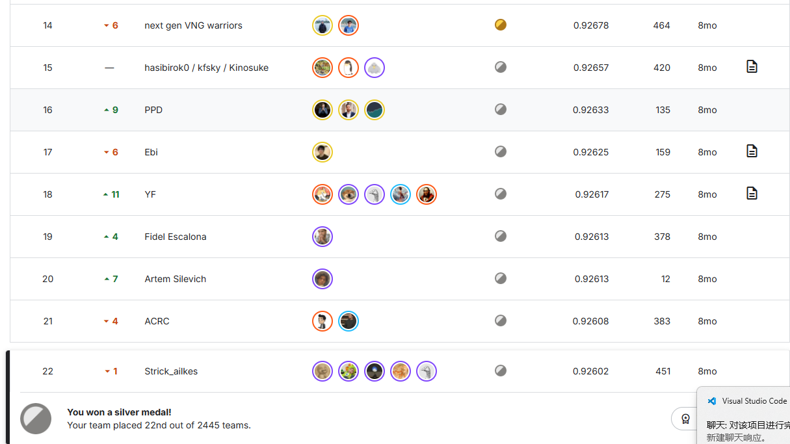

# Kaggle Jigsaw — Agile Community Rules Classification

[](https://www.kaggle.com/competitions/jigsaw-agile-community-rules/overview)
[](#)
[](#)
[-blueviolet)](#)

**Binary NLP classification** — predict whether a Reddit comment violates a subreddit's community rule. Metric: **Column-averaged ROC-AUC**.

---

## 🏆 Results

| Leaderboard | AUC | Rank |
|-------------|-----|------|
| Public | **0.931** | — |
| Private | **0.92602** | **🥈 22 / 2445** (Top 0.9%) |



---

## 📁 Project Structure

```
├── blendmymodel-ed5bf4.ipynb   # Main notebook (data prep + encoder models + ensemble)
├── Model1/                      # Qwen3-4B + mixed loss (multi-task auxiliary classification)
│   ├── constants.py             # Model path & hyperparameters
│   ├── utils.py                 # Data pipeline & RAG retrieval module
│   ├── train.py                 # QLoRA + CustomSFTTrainer
│   └── inference.py             # vLLM + RAG + TTA inference
├── Model2/                      # Qwen3-4B + mixed loss (same as Model1, different seed)
├── Model3/                      # Qwen-3-4B + pure SFT
├── Model4/                      # Llama-3.2-3B + pure SFT
├── RANK.png                     # Leaderboard screenshot
├── README.md                    # Chinese documentation
├── README_EN.md                 # English documentation
└── requirements.txt
```

---

## 🧠 Model Zoo

| # | Model | Backbone | Training Strategy | CV AUC |
|---|-------|----------|-------------------|--------|
| 1 | Qwen3-4B + Aux | `Qwen3-4B-Instruct-2507` | QLoRA + Mixed Loss | **0.923** |
| 2 | Qwen3-4B + Aux | `Qwen3-4B-Instruct-2507` | QLoRA + Mixed Loss | 0.923 |
| 3 | Qwen3-4B | `Qwen-3/4B` | QLoRA + Pure SFT | 0.920 |
| 4 | Llama-3.2-3B | `Llama-3.2-3B-Instruct` | QLoRA + Pure SFT | 0.920 |
| 5 | DeBERTa-v3 | `deberta-v3-base` | Full FT + Multi-Task | 0.912 |
| 6 | E5-BERT | `e5-base-v2` | Full FT + Multi-Task | 0.911 |
| 7 | BGE-Combined | `bge-small-en-v1.5` | BERT+TextCNN+FastText | 0.912 |

---

## 🔧 Key Techniques

### 1. Efficient Training: QLoRA + DeepSpeed

- **4-bit NF4 quantization** — base model memory reduced to 1/4
- **LoRA rank=64** — only ~3% parameters trained (~132M / 4B)
- **DeepSpeed ZeRO-2** — optimizer state & gradient sharding
- **Gradient Checkpointing** — activation recomputation, memory 20GB → **~5GB**
- 4B model fine-tuned on **T4×2 GPUs**

### 2. Multi-Task Auxiliary Loss

```
Total Loss = 0.8 × SFT (main) + 0.2 × Rule-Type Classification (auxiliary)
```

- **Main task**: Generate Yes/No after `Violation:` (Causal LM Cross-Entropy)
- **Auxiliary task**: Last hidden state → `nn.Linear(N+1)` → predict which rule was violated (CrossEntropy)
- Shared Transformer backbone forced to learn rule-aware representations

### 3. RAG + TTA Inference Augmentation

- **TF-IDF Retrieval**: Retrieve Top-K most similar labeled samples under the same rule
- **TTA**: 4 combinations of positive/negative examples × probability averaging
- CPU-only retrieval, zero GPU memory overhead

### 4. Weighted Model Ensemble

7 heterogeneous models with softmax dynamic weights based on per-rule CV AUC.

---

## 🚀 Quick Start

### Environment

```bash
pip install trl==0.21.0 peft accelerate datasets bitsandbytes==0.46.1
pip install vllm==0.10.0 logits-processor-zoo==0.2.1
pip install deepspeed==0.17.4
```

### Training

```bash
# LLM models (QLoRA + DeepSpeed)
accelerate launch --config_file accelerate_config.yaml Model1/train.py

# Encoder models (full fine-tune)
python train_deberta.py
python train_e5_bert.py
```

### Inference

```bash
python Model1/inference.py   # → Qwen3_4B_7_submission.csv
python Model3/inference.py   # → Qwen3_submission.csv
python Model4/inference.py   # → llama_submission.csv
```

### Ensemble

Run the final ensemble cell in the notebook to generate `submission.csv`.

---

## 📊 Ablation Study

| Configuration | Baseline | +Aux Loss | +RAG TTA | +7-Model Ensemble |
|--------------|:--------:|:---------:|:--------:|:-----------------:|
| AUC | 0.918 | +0.004 | +0.002 | +0.007 |
| Cumulative | 0.918 | 0.922 | 0.924 | **0.931 / 0.926** |

---

## 📝 Competition Info

- **Link**: [Jigsaw - Agile Community Rules Classification](https://www.kaggle.com/competitions/jigsaw-agile-community-rules/overview)
- **Task**: Classify whether a Reddit comment violates a given subreddit rule
- **Metric**: Column-averaged ROC-AUC
- **Challenges**: 4 unseen rule types, heavy slang/special characters, strict inference time limits

---

## 📄 License

MIT
